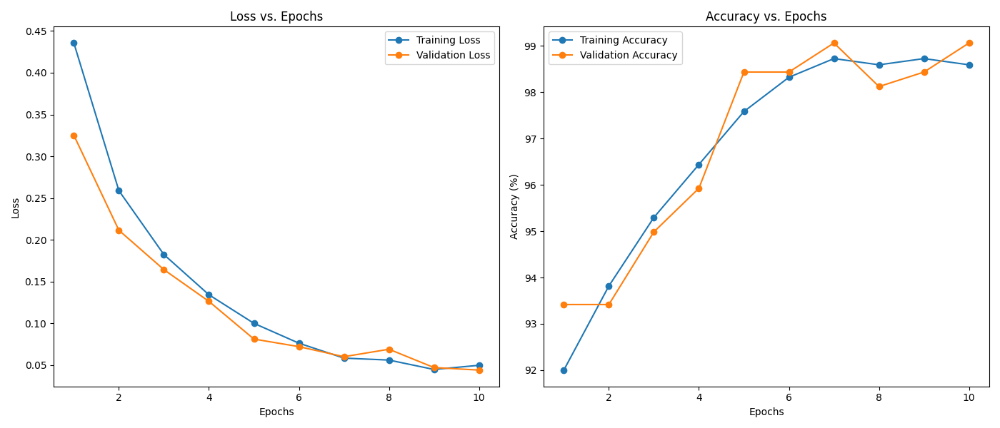
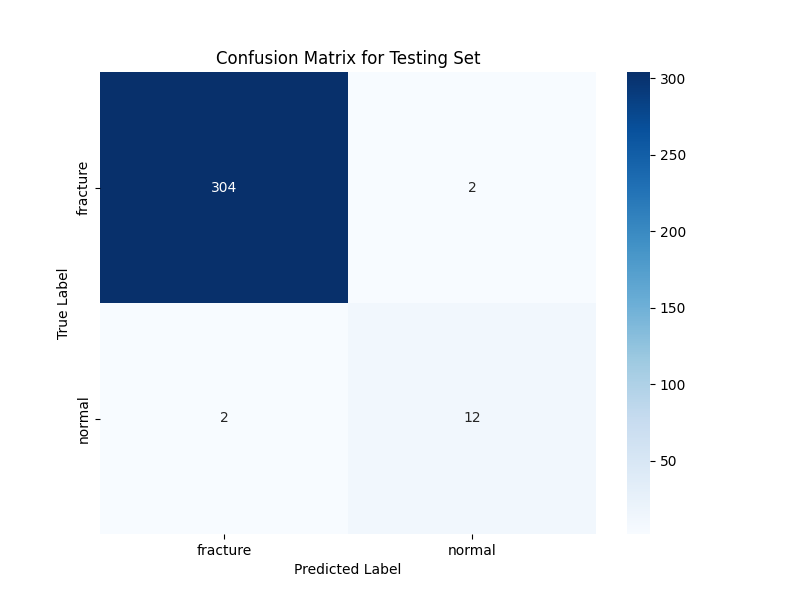

# Bone Fracture Detection using Deep Learning

This project uses a fine-tuned ResNet50 model to detect bone fractures in X-ray images with high accuracy. The model was built with PyTorch and trained on a public dataset from Kaggle.

## Project Structure

- `train.py`: The main script to run the entire training and evaluation process.
- `model.py`: Defines the ResNet50 model architecture.
- `utils.py`: Contains helper functions for data loading, plotting, and evaluation.
- `config.py`: Holds all the configuration settings for the project.
- `requirements.txt`: Lists the necessary Python libraries to run the project.

## Results

To ensure the model generalizes well and avoids overfitting, it was trained using **data augmentation** and **early stopping**. After a full training run, the final model achieved a more robust and realistic **98.75% accuracy** on the untouched test set.

### Performance Curves


### Confusion Matrix (Test Set)


## How to Run

1.  **Clone the repository:**
    ```bash
    git clone [https://github.com/MahmoudSalahX/bone-fracture-detection.git](https://github.com/MahmoudSalahX/bone-fracture-detection.git)
    cd bone-fracture-detection
    ```

2.  **Install the dependencies:**
    ```bash
    pip install -r requirements.txt
    ```

3.  **Download the Dataset and Model:**
    * Download the image dataset from [this Kaggle page](https://www.kaggle.com/datasets/vuppalaadithyasairam/bone-fracture-detection-using-x-rays). You will need to update the `DATA_DIR` path in `config.py`.
    * **IMPORTANT:** The trained model file (`bone_fracture_model_final.pth`) is too large for GitHub. You can download it from the output of the original [Kaggle Notebook here](https://www.kaggle.com/code/mahmoudsalaheldeen/bone-fracture-detection-model). Place the `.pth` file in your project folder.

4.  **Run the training script:**
    ```bash
    python train.py
    ```
